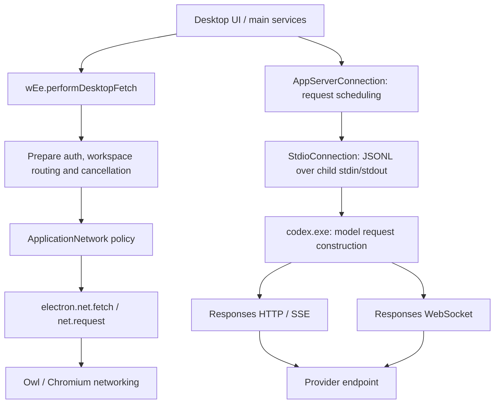

# Desktop request chain and plaintext integration

This is an evidence-backed design decision, not a new shipped interception path.
The production compatibility gate in [traffic](traffic.md) remains unchanged.
Do not extend the failed Desktop CONNECT/proxy-auth/certificate workaround.

## Reviewed build

Windows package `26.915.4065.0` runs the **Owl app shell**, reporting
Electron/Chrome `153.0.8010.48`, Node `24.19.0`. Its package.json lists an upstream
Electron development dependency, but bootstrap explicitly rejects stock Electron.
Use the installed implementation and owned-process evidence, not that dependency
version, to decide available APIs.

| Input | SHA-256 |
| --- | --- |
| `bootstrap-DK4EfNwt.js` | `dbdbdd3ef5dde93dd196a59846edf244dc653341213e0fd45eebb133b5df10ba` |
| `main-LM8MUIFp.js` | `c71bf3ffecef5fd390b4cd16d120d39dce30d30bffe3c563c8c74c1b691da018` |
| `src-C3YaUE83.js` | `14c8c23e8b8dfa874d3fb5a50d54fb28eccf55fb83232c3ab29cb7c0ef0a0472` |
| `codex.exe` (`0.155.0-alpha.9.2`) | `bc45017e8239dc150258f69309ced9df6bbcdf5b8e4f346decf780ac0999e226` |

The extracted official code stays in ignored local artifacts; it is not a source
dependency or a distributed payload. The research fixture checks these hashes
before using private symbols.

## Actual paths



`ApplicationNetwork` (`Pt` in bootstrap) checks policy and installs session
restrictions. Its `fetch` and `request` then call `electron.net`. It is not a
complete transport. In main, `wEe.performDesktopFetch` resolves credentials and
workspace routing before calling it. Upload progress uses `performProgressRequest`
and a `ClientRequest`; wrapping fetch alone misses this branch. That upload
wrapper already buffers its response in the official implementation.

`AppServerConnection` (`src` export `un`) schedules `thread/start` and `turn/start`.
Local `hQ` (export `dn`) selects a `mQ` StdioConnection, which spawns the resolved
`codex app-server`, writes JSONL to stdin and parses stdout. Remote/cloud `qZ`
(export `pn`) instead carries **AppServer RPC** over a WebSocket. That RPC socket
is distinct from the backend's **model Responses WebSocket**. Altering UI/RPC
notifications does not repair a failed model stream inside the backend.

The Rust backend contains separate HTTP, SSE and Responses WebSocket paths. The
[upstream ModelClient](https://github.com/openai/codex/blob/main/codex-rs/core/src/client.rs)
and [Responses WebSocket implementation](https://github.com/openai/codex/blob/main/codex-rs/codex-api/src/endpoint/responses_websocket.rs)
corroborate the split; they are not asserted to be the exact installed source.
The installed binary contains reqwest/rustls and Windows TLS-related code. Its
exports do not provide an established plaintext model hook. Importing a Windows
TLS function is not proof that this model request uses it. Native inline hooks
would need separate call-site/ABI evidence for each build and architecture.

## Verified integration points

1. **Desktop JS boundary.** In an owned official main process, interception of
   `net.fetch` and `net.request` observed and changed request content and response
   content passing through the real `wEe` methods. The local origin received the
   modified body; the wrapper returned the modified response. This proves a JS
   plaintext integration point, not complete browser/session/worker coverage.
   Preserve the official auth, policy and abort pipeline; do not replace it with
   an unauthenticated generic fetch.
2. **Model provider endpoint.** The desktop's `EQ` function turns
   `CODEX_APP_SERVER_OPENAI_BASE_URL` and `CODEX_APP_SERVER_CHATGPT_BASE_URL` into
   `-c openai_base_url=...` and `-c chatgpt_base_url=...` on the exact backend child.
   `openai_base_url` directs built-in OpenAI **inference**, including the tested
   synthetic ChatGPT auth mode. `chatgpt_base_url` is a separate backend-service
   setting; do not assume changing it alone covers inference. Custom providers
   use their own `base_url`.
3. **Full desktop-to-backend connection.** A request through the actual desktop
   AppServerConnection completed a synthetic model turn via the local provider
   endpoint. The response modification reached the actual connection's model
   notifications. The main-process `electron.net` hook saw **zero** model requests.

The provider endpoint is an explicit local destination. It is not an in-process
Rust/TLS hook and does not intercept existing encrypted sockets. The local bridge
can forward normally with HTTPS/WSS and normal certificate verification. This
removes the need for CONNECT authentication, forged certificates or installed
roots, but still requires a private, authenticated, bounded local endpoint.

## Acceptance and limits

`scripts/verify-plaintext-backend.mjs` exercises the unmodified official binary
with three modes (custom provider, built-in API key, synthetic ChatGPT tokens)
over HTTP/SSE and WebSocket: **six cases**. Every case verifies actual rewritten
request dispatch to a separate local upstream, response replacement, a synthetic
503 replaced before backend consumption, two endpoint selections within one
thread, cancellation, and another successful turn afterward. Each case has three
completed turns and one interrupted turn. HTTP events are split across writes.
HTTP cancellation and WebSocket cancellation close the observed transport.

The built-in provider attempted WS even with both old responses-websocket feature
flags false. The HTTP fixture deliberately returns 426 to exercise fallback.
WS sends `response.create`, including `generate:false` prewarm. Synthetic ChatGPT
HTTP requests use **Zstandard**; custom/API-key requests used identity encoding.
WS continuation actually included `previous_response_id` in the fixture, so a
real provider change must handle that server-owned state explicitly.
Do not drop WS, prewarm, compression or cancellation when exposing a common API.

`scripts/verify-plaintext-desktop.mjs` uses a fresh, invisible official instance,
an exact-child pre-entry inspector, the real fetch wrapper and existing desktop
AppServerConnection. It tests two desktop request branches and one model turn.
Profile path shims are test isolation scaffolding needed by Owl's native Known
Folder lookup, not network fallbacks. No installed archive is changed. Both
drivers preserve original client identities, reap owned descendants by PID plus
creation time, and remove their private directories without `Remove-Item -Force`.
Reports contain counters and synthetic metadata, not bodies or account secrets.

These are local synthetic upstreams. They do **not** prove live login refresh,
enterprise workspace routing, attachments, remote/cloud backend model sockets,
browser page WS, Realtime/WebRTC, HTTP/2 behavior, macOS, or arbitrary providers.
Changing destination in this fixture proves routing control, not portability of
`previous_response_id`, cached model state or tool transactions between real
providers. Response repair must honor protocol state; a replacement cannot undo a
tool already executed or justify automatic replay of a non-idempotent request.

An additional owned-backend check used two tasks in the same local AppServer and
started their turns concurrently. On the reviewed binary, `x-client-request-id`
in each Responses HTTP request and WebSocket handshake exactly matched the
corresponding `thread/start` ID. The fixture routed the tasks to separate local
upstream paths, rewrote their wire models differently, and verified that each
response reached its own task. Upstream requests overlapped. After restarting
the backend and cold-resuming both tasks, HTTP requests still matched; both
WebSocket handshakes, prewarm frames and normal frames matched their respective
tasks. The report stores only match results and `a`/`b` labels, never header
values, task IDs or credentials. This establishes a task correlation key for
the reviewed local backend's Responses paths; other builds and remote/cloud
backends require separate evidence. Rewriting a wire model does not change the
backend's task model configuration, context limits or tool capability decisions.

## Implementation boundary and recommendation

The implementation uses the verified desktop JS hooks and backend provider
routing. Native address patches require a separate experiment; neither
integration establishes coverage of all client traffic.

- **Core** owns generic traffic source admission, owner/generation leases,
  permissions, exact origins, bounded body/frame transport, cancellation and
  lifecycle. HTTP/SSE and WS enter the existing interception pipeline.
  A source reports its protocols and operations explicitly; unknown coverage
  stays unavailable. The generic pre-entry launch facility attaches the source
  without a proxy or generated CA descriptor.
- **Adapter** owns official build detection, private symbol/call-site mapping,
  child selection, provider configuration and Codex endpoint/event semantics.
  Read effective configuration and inject only into the owned runtime. Do not
  edit the user's config or spread temporary routing into tool/MCP processes.
- **Ordinary plugins** retain the same primitives and grant rules. Core selects
  declared capabilities, never official IDs/repository names. Official status
  confers no additional access. Interceptors run with the consuming plugin's
  permissions, never authority borrowed from the adapter.

### Task configuration and per-task routing

The former `codex.backend.transport@1` API selected a private channel at
`thread/start` or `thread/resume`. Its task configuration behavior is retained
under `codex.backend.write@1`: `registerThreadConfiguration` selects a model,
an already configured provider, or one task-local Responses provider at the
same boundary. A new provider's base URL must be a private loopback endpoint;
it does not inherit official OAuth. Core's public `context.traffic.openChannel`
and `openHttpChannel` remain available for a Host-owned local relay.
For real Desktop submissions, an explicit `turn.start` registration under the
same `backend.write` capability selects the model by task ID. It changes both
the native model parameter and any collaboration-mode model before the text
pre-submit hooks run; provider changes remain limited to thread start/resume.

| Capability | Former explicit attachment | Consolidated source and task configuration |
| --- | --- | --- |
| Selection | A plugin saw `thread.start` or `thread.resume` with `threadId`, `cwd`, `model` and `provider`, then selected a channel and optional model. | The generic task configuration callback changes model/provider before thread start/resume and, when registered for `turn.start`, selects each GUI turn's model using its task ID. The new source can use the reviewed backend's exact task ID header to route Responses requests. |
| Reach | The selected channel handled that task's Responses HTTP/SSE and/or WebSocket traffic from the local AppServer. | The owned backend's model HTTP/SSE and WebSocket paths and reviewed Desktop main-process HTTP branches enter the plaintext source after attachment. Already loaded tasks, established sockets and remote/cloud backend processes do not migrate. |
| Provider choice | A plugin could supply an independent local service through a private channel. | A task can select an existing provider or create one temporary no-OAuth Responses provider pointing at a private local relay. Host interceptors choose per-task upstreams with their own exact-origin grants. Wire model rewriting alone does not change backend model configuration. |
| Owner and lifetime | The private channel expired with its Host generation. | Core still owns source admission, generation leases, grants, bounds and cancellation. The Adapter's launch access grants no traffic authority to consumers. |

Core treats `x-client-request-id` as a sensitive header. The official Host SDK
reports a task ID from it only when the consuming plugin holds
`traffic.sensitiveHeaders` for that exact origin; otherwise its task ID stays
null. The Adapter does not expose the header or a task ID through a separate
ungranted path.

The failed CONNECT/proxy-auth/launch-CA path and dedicated thread transport
capability have been removed. Their task configuration behavior is covered by
the general callback and the plaintext source's HTTP/SSE and WebSocket paths.
The public channel API and generic Core traffic peer, registration and lease
machinery remain useful independently.

The generic launch/source contract reports activated and unsupported paths
separately. Version/source mismatch disables the unsupported integration with
a compatibility result; missing paths still require their own verification.
Neither Core nor its initialization depends on the official adapter package.

## Repeat

Use Node 24 with repository development dependencies installed, on Windows:

```text
node scripts/verify-plaintext-backend.mjs --run-owned yes --backend ABSOLUTE_CODEX_EXE
node scripts/verify-plaintext-desktop.mjs --run-owned yes --executable ABSOLUTE_CHATGPT_EXE --backend ABSOLUTE_CODEX_EXE
```

Ignored reports: `.artifacts/request-chain/backend-plaintext.json` and
`.artifacts/request-chain/desktop-plaintext.json`. These opt-in research drivers
do not run in normal CI, change installed plugins, or enable production traffic.

The packaged Adapter acceptance driver uses Node 24.21.0, a matching Core
checkout, and the current reviewed Desktop profile. For package `26.917.6896.0`:

```powershell
node scripts/verify-official-main-owned.mjs --run-owned yes `
  --core ABSOLUTE_CORE_CHECKOUT --executable ABSOLUTE_CHATGPT_EXE `
  --backend ABSOLUTE_CODEX_EXE --protocol ws `
  --bootstrap-bundle bootstrap-DwqRMhlU.js --main-bundle main-Bx5zswAj.js `
  --app-server-module src-mOb8On4V.js --fetch-wrapper-symbol ZTe `
  --application-network-factory x
```

Repeat with `--protocol http` for the HTTP/SSE fallback. The driver runs the
production Host and Core JavaScript data plane with a local Native authorization
fixture, a fresh synthetic account/profile and loopback upstreams. It checks
request/response rewriting, native redirect behavior, raw-versus-hooked cookie
behavior, completed turns and exact-owned process cleanup. It does not establish
live account refresh, real Native authorization, or full launcher/installer acceptance.
Only bounded counters, booleans and finite error codes enter the ignored reports
under `.artifacts/request-chain/current/owned-acceptance/`.
